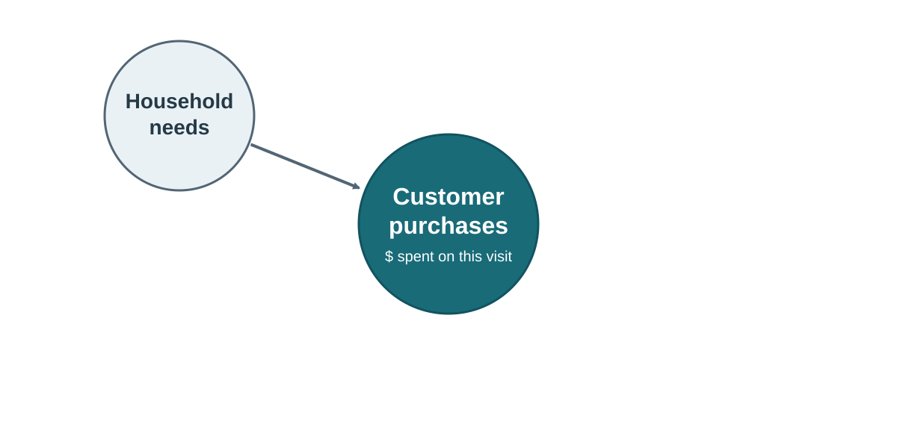
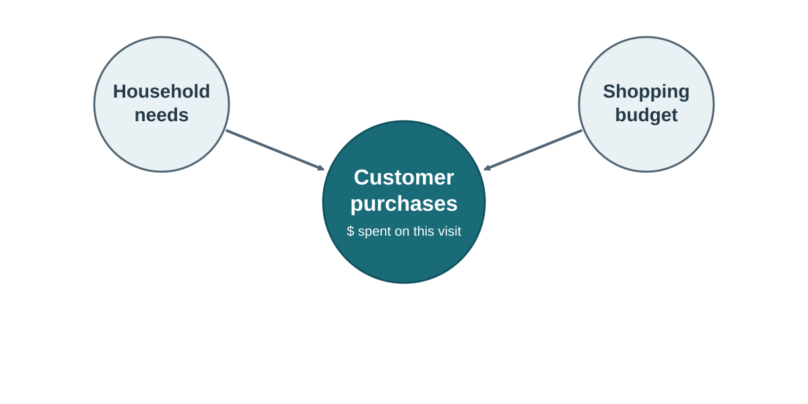
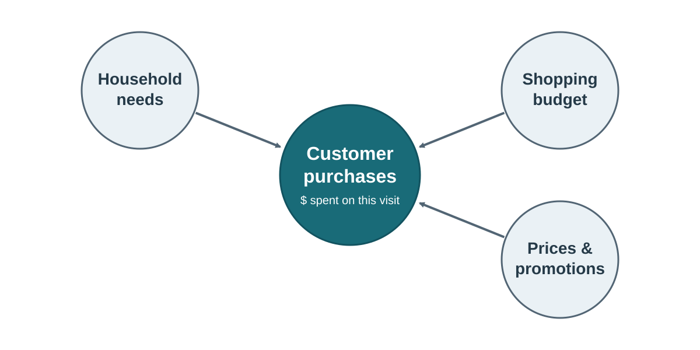
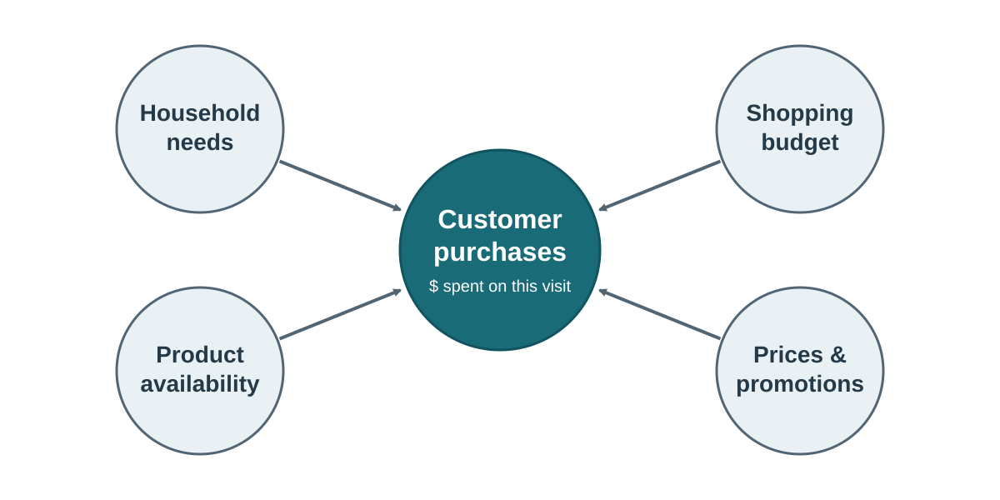
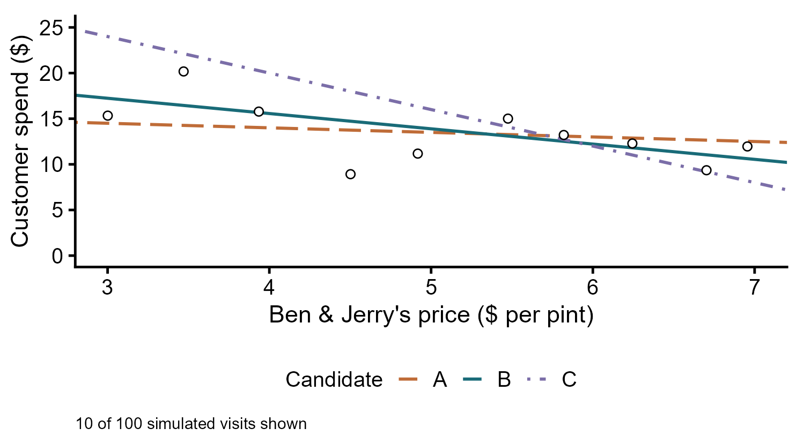
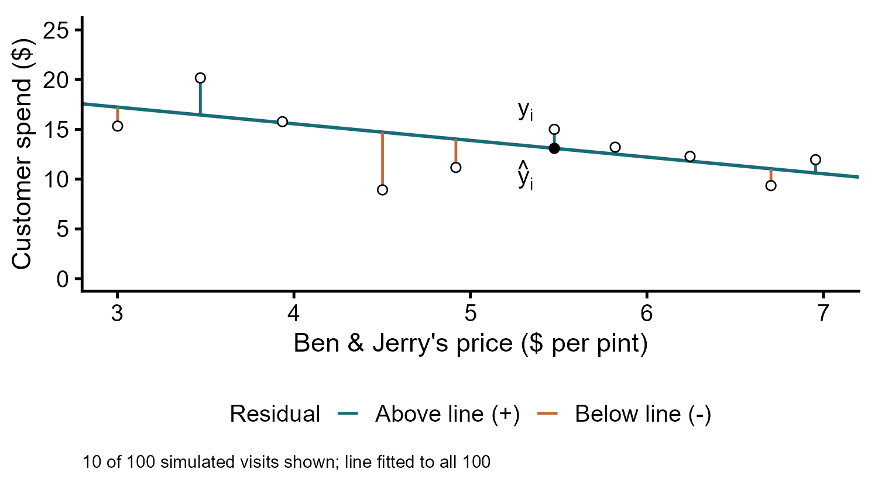

## Today's Learning Goals

- Translate a customer-spending question into a linear model.
- Distinguish parameters, statistical error, and fitted residuals.
- Simulate data and explain how least squares fits a line.
- Fit a regression with tidymodels and interpret slopes in their units.

## Models Quantify Inputs and Outcomes

Think of a **model** as a way to quantify how inputs help determine an outcome we care about.

**Inference** uses observed data to estimate those relationships. We start with a story about the inputs and outcome, then fit and evaluate the model.

## Grocery Store | The Outcome

A customer enters the grocery store. How much will they purchase?

<center>
{width=840px}
</center>

## Grocery Store | The Inputs

What does the household need to buy on this visit?

<center>
{width=840px}
</center>

## Grocery Store | The Inputs

How much money can the customer spend on groceries?

<center>
{width=840px}
</center>

## Grocery Store | The Inputs

How might prices and promotions change what the customer purchases?

<center>
{width=840px}
</center>

## Grocery Store | The Inputs

Can the customer find the products they want?

<center>
{width=840px}
</center>

## Realities of Data

We almost never have data on all of the inputs that determine an outcome!

Prices & Promotions? **Easy**.

Household needs & Shopping budget? **Much harder**.

## All Models Are Imperfect

Even an imperfect model can help us learn *something* about a process.

<center>
{width=650px}
</center>

**"I know more than nothing!"**

## Build | Ben & Jerry's Spending

How might the price of Ben & Jerry's relate to how much a customer spends on it during a grocery-store visit?

- **Outcome ($y$):** customer spending on Ben & Jerry's, in dollars.
- **Input ($x$):** price per pint, in dollars.

An illustrative relationship:

$$\text{CustomerSpend} = 24 - 2 \times \text{Price} + \text{other influences}$$

At a $5 price, expected spending is $14.

## Build | A Linear Model

We can write this spending story more generally:

$$y = \beta_0 + \beta_1 x + \epsilon$$

- $y$: **outcome** (response/dependent variable).
- $x$: **explanatory variable** (predictor/independent variable).
- $\beta_0$ and $\beta_1$: **intercept** and **slope** parameters; unknown when we fit a model to observed data.
- $\epsilon$: unobserved **error**, including household needs, budgets, and chance variation left unexplained by this model.

## Notes on $\beta_1$

$$y = \beta_0 + \beta_1 x + \epsilon$$

Our slope estimate, $\beta_1$, describes an association, **not a causal relationship** (except under very specific circumstances).

## Modeling Error

Linear regression is a model for a **continuous outcome** (*e.g.*, sales). For this class, assume independent errors with mean zero and constant variance:

$$\epsilon \sim Normal(0, \sigma^2)$$

- $\sigma$ is the error's standard deviation.

## Normal Probability Distribution

A **probability distribution** describes how values are distributed, and how relatively likely those values are.

- **Support:** the possible values (the full real line for a normal distribution).
- **Probability** over an interval: the area under the curve in that interval.

<center>
{width=750px}
</center>

## Uniform Probability Distribution

The **uniform distribution** assigns equal density across its support.

- What is its support?
- What is the most likely value under this uniform distribution?

<center>
{width=750px}
</center>

## Hypothetical Data

Ben & Jerry's Example: choose $\beta_0 = 24$, $\beta_1 = -2$, and $\sigma = 3$.

$$\text{CustomerSpend} = 24 - 2 \times \text{Price} + \epsilon$$

To create 100 hypothetical customer visits, simulate prices uniformly from $3 to $7 per pint, simulate errors, and calculate spending from the equation.

## Simulate Ben & Jerry's Spending

```{r message=FALSE, warning=FALSE}
# Load packages.
library(tidyverse)

# Set the randomization seed to simulate the same data each time.
set.seed(42)

# Set the parameter values.
beta0 <- 24
beta1 <- -2

# Simulate data.
sim_data <- tibble(
  Price = runif(100, min = 3, max = 7),
  CustomerSpend = beta0 + beta1 * Price + rnorm(100, mean = 0, sd = 3)
)
```

## Plotting Our Simulated Data

```{r, fig.height=3.5}
sim_data |>
  ggplot(aes(x = Price, y = CustomerSpend)) +
  geom_point() +
  labs(x = "Ben & Jerry's price ($ per pint)",
       y = "Customer spending ($ per visit)")
```

## A Note on Reproducible Random Draws

`set.seed()` restarts the random-number sequence so the same code produces the same simulated data.

```{r}
# Successive draws usually differ.
rnorm(1)
rnorm(1)

# Restarting from the same seed repeats the draw.
set.seed(42)
rnorm(1)

set.seed(42)
rnorm(1)
```

## Finding the Best Line

Fitting estimates $\beta_0$ and $\beta_1$ from data. Which candidate line fits best, and how should we decide?

<center>
{width=700px}
</center>

## Residuals

After fitting, a **residual** is $y - \hat{y}$: the observed vertical difference from the fitted line, an estimate of the unobserved error $\epsilon$.

<center>
{width=700px}
</center>

## Minimizing the Sum of Squared Residuals

Residuals can be positive or negative, so adding them directly allows cancellation.

**Least squares** chooses the intercept and slope that minimize:

$$\sum_{i=1}^{n}(y_i - \hat{y}_i)^2$$

Squaring prevents cancellation and gives larger misses more weight.

Ben & Jerry's Example: minimize the squared differences between **actual** sales $y_i$ and **predicted** sales $\hat{y}_i$.

## Using tidymodels

**tidymodels** provides consistent modeling syntax. Specify the **model type** with `linear_reg()` and the **engine** (the implementation) with `set_engine("lm")`.

```{r, message=FALSE}
library(tidymodels)
```

```{r}
reg_model <- linear_reg() |> 
  set_engine("lm")
```

## Modeling Hypothetical Data

We chose the **exact** story behind how customer sales are determined in our hypothetical data.

So what results should we see from our model?

## Fit the Model

`fit()` uses **formula notation**: `outcome ~ explanatory variable`. 

```{r}
reg_model <- reg_model |>
  fit(CustomerSpend ~ Price, data = sim_data)
```

## Inspect the Model

`tidy()` returns a table of **parameter estimates**.

```{r}
reg_model |>
  tidy()
```

How close are the estimates to our chosen values, 24 and -2? Why might they differ? Interpret the slope in dollars.

## Questions?

## Let's Step Things Up!

## Consider | Understanding Customer Spending

A fictional online home-goods retailer wants to understand which customers tend to spend more before planning targeting campaigns. It has household survey responses linked to customer records.

- How could household income relate to spending at this retailer?
- What else might influence customer spending?

Remember: a model simplifies the full story. Its usefulness depends on the question and whether its assumptions are reasonable.

## Our Customer Data

- `home_goods_customers.csv`: 10,000 customers, one row per customer.
- `HouseholdIncome`: annual household income, in dollars.
- `PreviousSpend`: dollars spent at this retailer over the previous 12 months.
- `HouseholdSize`: number of people in the household, including the customer.

Reference the accompanying `data_dictionary.pdf` for definitions.

## Build : Turn the Story into a (Hypothetical) Model

Start with an illustrative equation. Let `IncomeThousands` be annual household income divided by 1,000:

$$\widehat{\text{PreviousSpend}} = 750 + 3 \times \text{IncomeThousands}$$

- **Input:** annual household income in thousands of dollars. 
- **Output:** predicted previous 12-month spending in dollars.
- **Intercept:** predicted spending is $750 at zero income; zero is outside our observed income range.
- **Slope:** another $1,000 of household income is associated with $3 more predicted spending.

## From Simulation to Customer Data

Let's analyze some actual data!

```{r}
customers <- read_csv("home_goods_customers.csv", show_col_types = FALSE)

customer_model_data <- customers |>
  drop_na(HouseholdIncome, PreviousSpend) |>
  mutate(IncomeThousands = HouseholdIncome / 1000)
```

This leaves 9,800 customers with observed income and spending.

## Plotting Customer Spending

```{r, eval=FALSE}
customer_model_data |>
  ggplot(aes(x = IncomeThousands, y = PreviousSpend)) +
  geom_point(alpha = 0.15) +
  labs(x = "Annual household income ($1,000s)",
       y = "Previous 12-month spending ($)")
```

## Plotting Customer Spending

```{r, fig.height=3.5, echo=FALSE}
customer_model_data |>
  ggplot(aes(x = IncomeThousands, y = PreviousSpend)) +
  geom_point(alpha = 0.15) +
  labs(x = "Annual household income ($1,000s)",
       y = "Previous 12-month spending ($)")
```

What pattern would a straight line capture? What variation would remain?

## Fit the Customer Model

```{r}
customer_model <- linear_reg() |>
  set_engine("lm") |>
  fit(PreviousSpend ~ IncomeThousands, data = customer_model_data)

customer_model |>
  tidy()
```

Focus on the `estimate` column today. We interpret the other columns next time.

## Interpret the Customer Model

The fitted equation is approximately:

$$\widehat{\text{PreviousSpend}} = 760.42 + 2.57 \times \text{IncomeThousands}$$

- Another $1,000 of annual household income is associated with about $2.57 more spending at this retailer over 12 months.
- The intercept is a prediction at zero income, outside the observed range of $15,000 to $350,000.

Having a higher income does **not cause** a customer to spend more.

Having a higher income *is associated with* higher spending.

## More Than One Explanatory Variable

The same model can include a second explanatory variable:

$$y = \beta_0 + \beta_1 x_1 + \beta_2 x_2 + \epsilon$$

In `fit()`, the formula becomes `y ~ x1 + x2`.

Each slope describes a one-unit difference in its variable **holding the other included variable fixed**. The slope coefficients are still associations!

## Live Coding Exercise

The home-goods retailer's leadership wants an additional analysis of how customer incomes and ages are related to past spending.

What could the relationship between age and spending look like?

Let's answer this question with a model.

## Wrapping Up

Today we simulated a known relationship, estimated it from data, and applied the same modeling approach to customer spending.

*Next Time*

- Evaluating model fit.

*Supplementary Material*

- *Tidy Modeling with R* Chapter 6.1

*Artwork by @allison_horst*

## Exercise 5: Customer Spending

The home-goods retailer wants to understand how past customer spending differs with household income and household size before planning outreach.

Use `home_goods_customers.csv` and its data dictionary. The outcome is `PreviousSpend` (dollars at this retailer over 12 months); the two explanatory variables are `HouseholdIncome` (annual dollars) and `HouseholdSize` (people).

Express income in thousands of dollars. Use customers with observed values for the model's variables and report how many are included. The question concerns historical spending, not the later email campaign.

## Exercise 5: The Client Report

Submit a Word document rendered from Quarto with your code, results, and interpretation. Include:

- A fitted linear model relating previous spending to both household characteristics, with a coefficient table.
- The direction and dollar interpretation of each slope, holding the other included characteristic fixed.
- A brief conclusion for the retailer, including why these associations alone do not establish that an outreach action would increase spending.

Choose the code operations and their sequence. Upload your report to Canvas's **Exercise 5** assignment.
